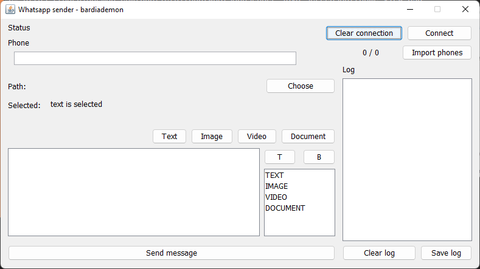
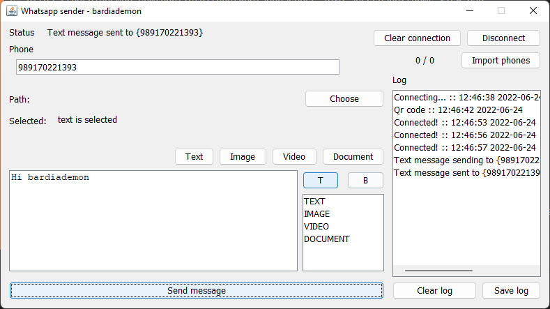
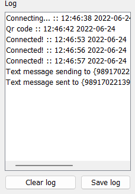

bardiademon
<h1 align="center">
    
     
    Whatsapp Sender GUI
</h1>

    
    
    

This app is made with Java 17 and <a href="https://github.com/Auties00/WhatsappWeb4j">WhatsappWeb4j</a> 

 

    
    &nbsp;
    
    &nbsp;

<h1 align="center">
    📊 Repo Stats
</h1>

    
    
    

 

<h1 align="center">
    💻 Technologies
</h1>

    

<h1 align="center">
    🌟 Spread the word!
</h1>

If you want to say thank you:

- Add a GitHub Star to the project!
- Follow my github [bardiademon](https://github.com/bardiademon)

 

<h1 align="center">
    ⚠️ License & 📝 Credits
</h1>

by bardiademon [https://bardiademon.com](https://www.bardiademon.com)
